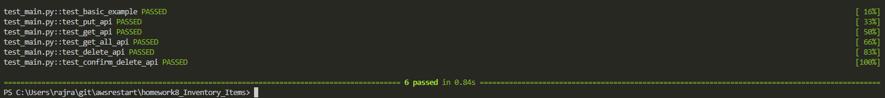

# AWS reStart Homework
### Tic-Tac-Toe Board
[Week 2 - Homework 1 (Jupyter Notebook)](https://github.com/rajrtd/awsrestart/tree/master/homework/week2/homework_1.ipynb)

[Week 2 - Homework 1 (Python File)](https://github.com/rajrtd/awsrestart/tree/master/homework/week2/board.py)

[Week 2 - Homework 1 (Output of Python File)](https://github.com/rajrtd/awsrestart/tree/master/homework/week2/output.txt)
### Caesar Script
[Week 2 - Homework 2](
    https://github.com/rajrtd/awsrestart/tree/master/homework/week2/homework_2.ipynb
)

[Week 2 - Homework 2 Attempt 2](
    https://github.com/rajrtd/awsrestart/tree/master/homework/week2/homework_2_attempt_2.ipynb
)

### AES and RSA Encryption

[Week 2 - Homework 3 & 4](
    https://github.com/rajrtd/awsrestart/tree/master/homework/week2/homework_3_4.ipynb
)

### Object Oriented Programming

[Week 2 - Homework 5 & 6](
    https://github.com/rajrtd/awsrestart/tree/master/homework/week2/homework_5_6.ipynb
)

### Library with data classes

[Week 3 - Homework 7](https://github.com/rajrtd/awsrestart/blob/master/homework7/main.py)

### Inventory Items
[Week 3 - Homework 8](https://github.com/rajrtd/awsrestart/tree/master/homework8_Inventory_Items)

### Library
[Week 3 - Homework 8](https://github.com/rajrtd/awsrestart/tree/master/homework8_library)

### Testing Inventory Items API
[Week 3 - Homework 9]()

### Testing Library API
[Week 3 - Homework 9]()
